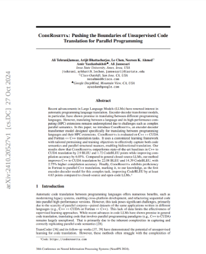

# CodeRosetta
## Pushing the Boundaries of Unsupervised Code Translation for Parallel Programming
*Repository of CodeRosetta ([Paper](https://arxiv.org/abs/2410.20527), [Website](https://coderosetta.com/)).*  

**CodeRosetta** is an encoder-decoder transformer model designed to translate code between C++ and CUDA, and Fortran and C++.
-  **Extendable**: CodeRosetta can be easily extended to support other programming languages and parallel programming libraries.

-  **Customized training objectives**: CodeRosetta leverages tailored pretraining and training objectives to enhance translation between programming languages and parallel programming interfaces.

-  **Supports CUDA and Fortran**: The current version of CodeRosetta supports translation from C++ to CUDA and from Fortran to C++.

If you're more of a paper person, check out our paper:  
[](https://arxiv.org/abs/2410.20527)

> :warning: **Work in Progress**: This is a public version of our code, this version is published to foster further research efforts. Please note that the current version may not fully reproduce our work, as a complete end-to-end validation has not been conducted. Thank you!


## Requirements
CodeRosetta is built on top of Transformers and Accelerate.

    pip install transformers[sentencepiece] accelerate datasets evaluate sacrebleu seqeval codebleu tree-sitter-cpp==0.21.0

## Datasets
### Dataset Structure
  CodeRosetta requires 6 files for for translation from language A to B in the following format:
-  `lang_a.mono.train.format`: Train set of the first language.
-  `lang_b.mono.train.format`: Train set of the second language
-  `lang_a.para.valid.format`: Validation set of the first language.
-  `lang_b.para.valid.format`: Validation set of the second language.
-  `lang_a.para.test.format`: Test set of the first language.
-  `lang_b.para.test.format`: Test sef of the second language.  
  
`mono` files are unpaired files. There are not relation between them.
`para` files are parallel/pair sets.  
For instance, the first sample in `lang_a.para.valid.format` should correspond to the first sample in `lang_b.para.valid.format`. The same for test set.

### Datasets:

**C++ to CUDA**:  
This dataset is retrieved from [BabelTower](https://proceedings.mlr.press/v162/wen22b.html) authors.  
Test and Validation set are located [here](https://github.com/IPRC-ICT/BabelTower/tree/main/dataset).  
We have uploaded the whole dataset [here](https://drive.google.com/drive/folders/1wPJ_reSaCjCKY631kFHytmYbuMh-mK1Z?usp=sharing).  

**Fortran To C++**:  
The train set of this dataset is retrieved from [StackV2](https://huggingface.co/datasets/bigcode/the-stack-v2-dedup).  
Paired trainset and testset are retrieved from [HPC_Fortran_CPP](https://huggingface.co/datasets/HPC-Forran2Cpp/HPC_Fortran_CPP).  
We have uploaded the whole dataset [here](https://drive.google.com/drive/folders/1L2TKsRT_ColKaD28nZtLhs3b4p5fFIDc?usp=sharing).  

## Training

**For C++ to CUDA training:**

If you've got one GPU:

    python main.py --langs cpp cuda --train_mode mlm aer bt ft eval --dataset_format tok

  

If you have multiple GPUs use `accelerate launch`:

    accelerate launch --num_processes=2 main.py --langs cpp cuda --train_mode mlm aer bt ft eval --dataset_format tok

*`main.py` has a set of configurable flags.*  
*please run `python main.py -h` to see the list of all available flags.*

**For Fortran to C++ training:**  

    python main.py --langs fortran cpp --train_mode mlm bt ft eval --dataset_format jsonl

To leverage multiple-GPU training use `accelerate launch`.

## Training Arguments

  

    - `--whole_word_masking_mlm`: Enables whole word masking for MLM.
    - Action: `store_true`
    - Default: `True`
    
    - `--train_mode`: List of training modes to use.
    - Choices: `["mlm", "aer", "bt", "ft", "eval"]`
    
    - `--only_bt`: Disables DAE and enables only BT.
    - Action: `store_true`
    
    - `--only_dae`: Disables BT and enables only DAE.
    - Action: `store_true`
    
    - `--wwm_probability`: Whole word masking probability.
    - Type: `float`
    - Default: `0.15`
    
    - `--shuffle_batch_order`: Flag to shuffle batch order for seq2seq training.
    - Action: `store_true`
    - Default: `False`
    
    - `--shuffle_within_batches`: Flag to shuffle samples within batches.
    - Action: `store_true`
    - Default: `True`
    
    - `--learning_rate_mlm`: Learning rate for MLM training.
    - Type: `float`
    - Default: `0.00008`
    
    - `--learning_rate_aer`: Learning rate for AER training.
    - Type: `float`
    - Default: `0.000005`
    
    - `--learning_rate_bt`: Learning rate for BT training.
    - Type: `float`
    - Default: `0.00005`
    
    - `--learning_rate_ft`: Learning rate for FT training.
    - Type: `float`
    - Default: `0.00004`
    
    - `--weight_decay`: Weight decay factor.
    - Type: `float`
    - Default: `0.01`
    
    - `--num_warmup_steps`: Number of warmup steps.
    - Type: `int`
    - Default: `0`
    
    - `--percent_warmup_steps`: Percentage of warmup steps.
    - Type: `float`
    - Default: `0.01`
    
    - `--scheduler_type`: Scheduler type for learning rate adjustment.
    - Choices: `["linear", "cosine", "cosine_with_restarts", "polynomial", "constant", "constant_with_warmup", "inverse_sqrt", "reduce_lr_on_plateau"]`
    - Default: `inverse_sqrt`
    
    - `--chunk_size`: Maximum length of each sample.
    - Type: `int`
    - Default: `512`
  
    - `--enable_early_stopping`: Enables early stopping.
    - Action: `store_true`
    
    - `--early_stopping_threshold`: Threshold for early stopping.
    - Type: `int`
    - Default: `0`
    
    - `--early_stopping_patience`: Number of steps with no improvement before stopping early.
    - Type: `int`
    - Default: `5`
    
    - `--batch_size`: Batch size for training.
    - Type: `int`
    - Default: `32`
    
    - `--max_gpu_batch_size`: Maximum GPU batch size.
    - Type: `int`
    - Default: `16`
    
    - `--num_train_epochs_mlm`: Number of training epochs for MLM.
    - Type: `int`
    - Default: `100`
    
    - `--num_train_epochs_aer`: Number of training epochs for AER.
    - Type: `int`
    - Default: `10`
    
    - `--num_train_epochs_bt`: Number of training epochs for BT.
    - Type: `int`
    - Default: `20`
    
    - `--num_train_epochs_ft`: Number of training epochs for FT.
    - Type: `int`
    - Default: `10`
    
    - `--max_steps`: Maximum number of steps for training (overrides num_train_epochs).
    - Type: `int`
    - Default: `0`
    
    - `--evaluation_strategy`: Evaluation strategy during training.
    - Type: `str`
    - Default: `epoch`
    
    - `--dae_warmup_steps`: Number of steps for DAE warmup phase.
    - Type: `int`
    - Default: `0`
    
    - `--dae_word_mask`: Word masking ratio for DAE.
    - Type: `float`
    - Default: `0.15`
    
    - `--dae_word_dropout`: Word dropout ratio for DAE.
    - Type: `float`
    - Default: `0.20`
    
    - `--dae_word_replacement`: Word replacement ratio for DAE.
    - Type: `float`
    - Default: `0`
    
    - `--dae_word_insertion`: Word insertion ratio for DAE.
    - Type: `float`
    - Default: `0.15`
    
    - `--dae_word_shuffle`: Word shuffle ratio for DAE.
    - Type: `float`
    - Default: `1`
    
    - `--ratio_steps_update`: Defines when DAE ratio should update (steps, epoch, half_epoch, or quarter_epoch).
    - Type: `str`
    - Default: `None`
    
    - `--ratio_percent_update`: Percentage of changes for updating DAE ratios.
    - Type: `float`
    - Default: `0.05`
    
    - `--ratio_percent_update_dropout`: Percentage of changes for updating the dropout ratio in DAE.
    - Type: `float`
    - Default: `0.025`
    
    - `--max_corruption_percent`: Maximum allowed sentence corruption for DAE.
    - Type: `float`
    - Default: `0.6`

  

  

## Pretrained Models
We release the pretrained C++ to CUDA and Fortran to C++ models.  
C++ to CUDA model and tokenizer are located [here](https://drive.google.com/drive/folders/1UqYVb1WqZCzIM4PQbYAYE6s2-8v-V4cc?usp=sharing).  
Fortran to C++ model and tokenizer are located [here](https://drive.google.com/drive/folders/1GpJSmpAs5T556ZnJlryT3dqbmUtlNbJA?usp=sharing).

## Evaluation:
To ran the evaluation ensure that model, tokenizer and data are placed to their repective directories.

For C++ to CUDA evaluation

    python main.py --langs cpp cuda --train_mode eval --dataset_format tok

  

For Fortan to C++ evaluation

    python main.py --langs fortran cpp --train_mode eval --dataset_format jsonl


For inference with multiple GPUs use `accelerate launch`.

  
## Adding new languages
In order to add new languages, ensure `src/util/langs_keyword.py` is updated and has information about the reserverd keywords for the new langauges.
Depending on the preprocessing, filtering steps required for the new language, please check dataset py files in (`src/dataset` ) and create your own `dataset.py` to reflect the preprocessings that are required for your datasets. 
  

## Citation

```bibtex
@inproceedings{coderosetta:neurips:2024,
  title = {CodeRosetta: Pushing the Boundaries of Unsupervised Code Translation for Parallel Programming},
  author = {TehraniJamsaz, Ali and Bhattacharjee, Arijit and Chen, Le and Ahmed, Nesreen K and Yazdanbakhsh, Amir and Jannesari, Ali},
  booktitle = {NeurIPS},
  year = {2024},
}